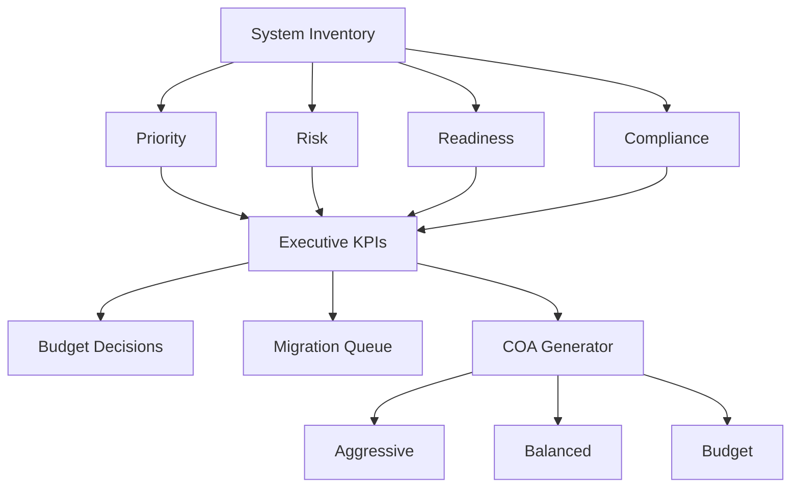

# 🔐 Post-Quantum Cryptographic Inventory & Risk Analysis Tool

## 📌 Overview

This project implements an automated system for **cryptographic inventory, risk analysis, and prioritization** in preparation for post-quantum cryptography (PQC) migration.

Modern cryptographic systems (RSA, ECC, Diffie–Hellman) are vulnerable to quantum attacks. This tool helps identify where cryptography is used, evaluates risk, and determines which systems should be migrated first.

This project demonstrates a scalable framework for prioritizing Post-Quantum Cryptography migration across multiple sections such as Enterprise, Tactical, Intelligence, SATCOM, Coalition, and platform enviornments using an automated risk analysis, readiness assessment, cost modeling, and campaign planning. 

---

## 🎯 Purpose

The objective of this project is to provide organizations with a scalable methodology for identifying quantum-vulnerable systems, assessing modernization readiness, prioritizing migration activities, and supporting executive decision-making through data-driven analytics which is efficient and decisive. 

The platform is designed so that organizations can upload their own cryptographic inventories in CSV or JSON format and automatically generate risk assessments, migration plans, readiness scores, and executive reports without modifying the source code. Which will expand it's presence from a small project to hopefully a massive expansion towards the future within Post-Quantum Cryptography. 

---

## 🚀 Features

- ✅ Cryptographic inventory model for system analysis  
- ✅ Detection of quantum-vulnerable algorithms (RSA, ECC, DH)  
- ✅ Risk scoring based on key factors:
  - Data lifetime  
  - Mission impact  
  - Exposure  
  - Upgrade difficulty  
- ✅ Time-based quantum threat simulation  
- ✅ Automated prioritization of systems  
- ✅ Classification into risk categories (CRITICAL / HIGH / LOW)  
- ✅ Migration recommendation engine  

---

## 🧠 Problem Motivation

Post-quantum migration is **not just about replacing algorithms**—it requires understanding:

- Where cryptography is used  
- What data is being protected  
- How long the data must remain secure  
- What happens if the system fails  

This project models these factors and provides a **data-driven prioritization strategy**.

---

## 🏗️ System Model

Each system is represented as:
Where:

- **A** = Algorithms (RSA, AES, ECC, etc.)  
- **P** = Protocols (TLS, VPN, etc.)  
- **D** = Data being protected  
- **L** = Data lifetime  
- **U** = Upgradeability  
- **M** = Mission impact  

---

## ⚠️ Risk Model

Priority is computed as a function of:

- Quantum vulnerability  
- Data lifetime  
- Mission impact  
- Exposure  
- Upgrade difficulty  

Additionally, a simulation estimates the probability that data will be compromised based on when quantum computers become practical.

---

## 📊 Example Output
Drone System
Priority: 18.0
Risk: 0.31
Recommendation: Immediate PQC migration
Category: CRITICAL
Public Website
Priority: 5.0
Risk: 0.0
Recommendation: Monitor
Category: LOW

---

## 💡 Key Insight

> Migration priority depends more on **data lifetime and mission impact** than on algorithm choice alone.

Not all systems require immediate migration—this tool identifies where action is most critical.

---

# New Features

## Coalition Readiness Assessment

Evaluate PQC readiness across coalition environments.

Features:
- Coalition risk scoring
- Interoperability risk analysis
- Coalition readiness scoring
- Coalition readiness categories:
  - READY
  - PARTIAL
  - AT RISK

Example systems:
- NATO Mission Network

---

## Intelligence Risk Analysis

Assess harvest-now-decrypt-later exposure.

Metrics:
- Archive Risk
- HNDL Score
- Classification Impact

Example systems:
- SIGINT Processing Node

---

## Military Readiness Dashboard

Evaluate operational readiness for PQC migration.

Metrics:
- Military Readiness Score
- Compliance Score
- Crypto Agility Maturity
- Mission Readiness Category

---

## Mission Domains

Supported domains:

- Enterprise
- Tactical
- SATCOM
- Intelligence
- Coalition
- Platform
- Operational

---

## Analytics

- Machine Learning Risk Prediction
- Dependency Graph Analysis
- Threat Surface Analysis
- Priority Scoring
- HNDL Forecasting

---

## Export Capabilities

- CSV Reports
- CBOM Generation
- Migration Planning Outputs

---

## Coalition Metrics

- Coalition Risk
- Coalition Readiness
- Coalition Category
- Interoperability Risk

---

## Executive KPIs

The dashboard provides leadership-focused metrics including:

- Average Quantum Risk
- Average Priority score
- Military Readiness score
- Coalition Readiness score
- Total Migration cost
- Risk reduction potential
- Migration Priority Queue
- Porrtfolio Compliance Percentage

## Executive Decision Framework



## 🖥️ Dashboard Interface

The application provides a multi-tab operational dashboard supporting portfolio-wide PQC assessment and migration planning.
Dashboard Modules

📋 System Inventory
⚠️ Risk Analysis
🧠 PQC Strategy
📊 Analytics
🚨 Alerts
📦 Export & Reports
📈 Executive Summary
🛰️ HNDL Intelligence
🪖 Military Readiness
🕵️ Intelligence Risk
🤝 Coalition Readiness
📜 NIST Compliance
📅 Campaign Planner
💰 Cost Modeling

## 📂 Data Import Support

The platform supports user-provided inventories through:
Supported Formats

JSON
CSV

Required Fields
{
  "name": "System Name",
  "algorithms": ["RSA"],
  "protocols": ["TLS 1.2"]
}
Army personnel can replace the dataset with their own without changing the source code through an upload function.

## 🔐 Cryptographic Bill of Materials (CBOM)

The tool automatically generates a CBOM for each system.
Generated fields include:

Current Algorithms
Recommended PQC Algorithms
Migration Phase
Network Domain
Readiness Status
Migration Difficulty
HNDL Score

## 🤖 Machine Learning Assisted Risk Assessment

The dashboard includes a lightweight machine-learning risk model used to:

Analyze system attributes
Estimate future quantum risk
Compare predicted and calculated risk
Provide explainable risk contributions

Metrics:

ML Risk Score
Confidence Score
Feature Contribution Analysis

## 💸 Cost Modeling

Migration investment planning capabilities include:
Cost Metrics

Migration Cost
Portfolio Cost
Risk Reduction Potential
Return on Investment (ROI)

Outputs

Cost Distribution
Best ROI Candidates
Portfolio-Level Cost Projections

## 📅 Campaign Planning

The Campaign Planner allows organizations to estimate migration schedules based on available funding.
Features include:

Annual Budget Constraints
Fiscal Year Planning
Migration Queue Generation
Course of Action (COA) Analysis

COAs:

Aggressive
Balanced
Budget-Constrained

## 📜 Compliance & Modernization

The platform evaluates cryptographic modernization readiness using:

NIST Compliance Metrics
Crypto Agility Assessment
TLS Upgrade Identification
Legacy Algorithm Detection

## 📈 Performance

Testing demonstrated: 

- 0.004 (4 miliseconds) processing time for the demonstration portfolio
- Near real-time generation of risk scores
- Automated CBOM generation
- Immediate readiness and migration assessments

  These results provide scalability of the architecture for larger operational datasets. 

Processing Performance
Testing demonstrated inventory processing times of approximately:

Benefits:
Automated prioritization
Immediate report generation

## 🎯 Results & Impact

Operational Improvements

Automated cryptographic inventory assessment
Reduced manual analysis effort
Accelerated migration planning
Improved portfolio visibility
Standardized risk prioritization
Executive decision support

Quantifiable Benefits

Near-instant portfolio processing
Automated CBOM generation
Automated migration roadmap generation
Automated risk and readiness calculations
Support for operational data replacement through CSV and JSON imports

## 🔄 Extensibility

The architecture was designed to support future integration with:

RMF Artifacts
ATO Documentation
Enterprise Asset Inventories
CMDB Platforms
PKI Repositories
Cyber Asset Management Systems
Army Enterprise Network Inventories

## 📸 Dashboard Screenshots

Within the Repository there are screenshots of the various functions:

- Risk Analysis Dashboard
- PQC Strategy Dashboard
- Analytics Dashboard 
- Executive Dashboard
- HNDL Intelligence Dashboard
- Military Readiness Assessment
- Coalition Readiness Dashboard
- Intelligence Dashboard
- NIST Compliance Dashboard
- Campaign Planning Interface
- Cost Modeling Dashboard

  ## 🧪 Technologies Used

- Python
- Streamlit
- Pandas
- NumPy
- Matplotlib
- NetworkX
- Streamlit Auto Refresh

  ## 🔮 Future Enhancements

Planned improvements include:

- Excel (.xlsx) import support
- Enterprise database connectivity
- AI-assisted migration recommendations
- Role-based access controls
- STIG and NIST automation

## 🧰 Installation

## Clone Repository

```bash
git clone https://github.com/your-org/pqc-dashboard.git
cd pqc-dashboard
```

### Install Dependencies

```bash
pip install -r requirements.txt
```

### Run Dashboard
```bash
streamlit run app.py
```

```bash
pip install -r requirements.txt
```

## 👥 Authors

Nicholas Ortiz

Project Focus:
- Post-Quantum Cryptography
- Cryptographic Inventory
- Cybersecurity Modernization
- Risk Assessment Automation
- Military Readiness Analysis
- Decision Support Analytics
