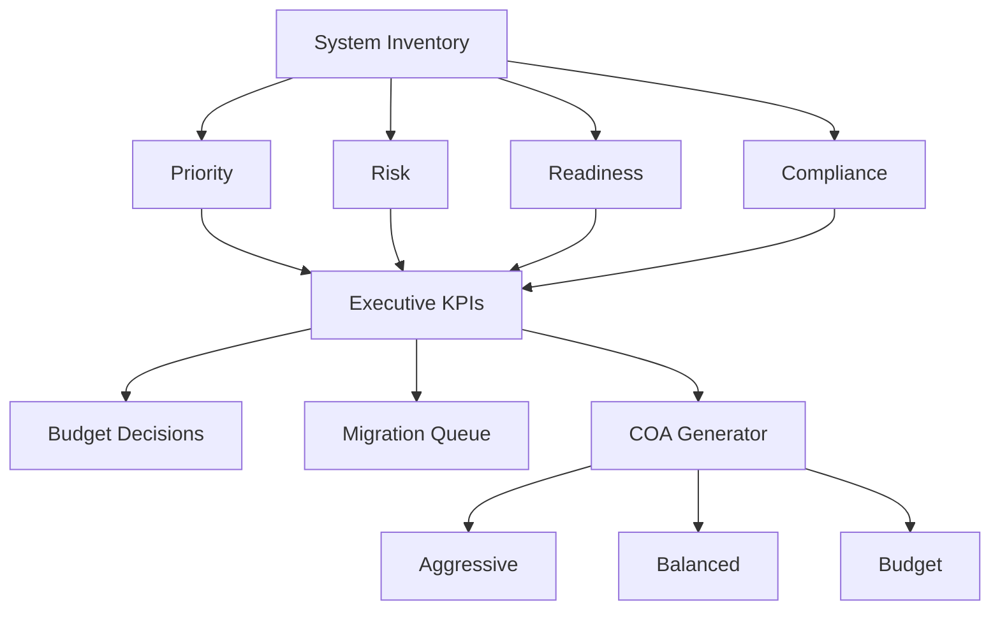

# 🔐 Post-Quantum Cryptographic Inventory & Risk Analysis Tool

## 📌 Overview

This project implements an automated system for **cryptographic inventory, risk analysis, and prioritization** in preparation for post-quantum cryptography (PQC) migration.

Modern cryptographic systems (RSA, ECC, Diffie–Hellman) are vulnerable to quantum attacks. This tool helps identify where cryptography is used, evaluates risk, and determines which systems should be migrated first.

---

## 🚀 Features

- ✅ Cryptographic inventory model for system analysis  
- ✅ Detection of quantum-vulnerable algorithms (RSA, ECC, DH)  
- ✅ Risk scoring based on key factors:
  - Data lifetime  
  - Mission impact  
  - Exposure  
  - Upgrade difficulty  
- ✅ Time-based quantum threat simulation  
- ✅ Automated prioritization of systems  
- ✅ Classification into risk categories (CRITICAL / HIGH / LOW)  
- ✅ Migration recommendation engine  

---

## 🧠 Problem Motivation

Post-quantum migration is **not just about replacing algorithms**—it requires understanding:

- Where cryptography is used  
- What data is being protected  
- How long the data must remain secure  
- What happens if the system fails  

This project models these factors and provides a **data-driven prioritization strategy**.

---

## 🏗️ System Model

Each system is represented as:
Where:

- **A** = Algorithms (RSA, AES, ECC, etc.)  
- **P** = Protocols (TLS, VPN, etc.)  
- **D** = Data being protected  
- **L** = Data lifetime  
- **U** = Upgradeability  
- **M** = Mission impact  

---

## ⚠️ Risk Model

Priority is computed as a function of:

- Quantum vulnerability  
- Data lifetime  
- Mission impact  
- Exposure  
- Upgrade difficulty  

Additionally, a simulation estimates the probability that data will be compromised based on when quantum computers become practical.

---

## 📊 Example Output
Drone System
Priority: 18.0
Risk: 0.31
Recommendation: Immediate PQC migration
Category: CRITICAL
Public Website
Priority: 5.0
Risk: 0.0
Recommendation: Monitor
Category: LOW

---

## 💡 Key Insight

> Migration priority depends more on **data lifetime and mission impact** than on algorithm choice alone.

Not all systems require immediate migration—this tool identifies where action is most critical.

---

# New Features

## Coalition Readiness Assessment

Evaluate PQC readiness across coalition environments.

Features:
- Coalition risk scoring
- Interoperability risk analysis
- Coalition readiness scoring
- Coalition readiness categories:
  - READY
  - PARTIAL
  - AT RISK

Example systems:
- NATO Mission Network

---

## Intelligence Risk Analysis

Assess harvest-now-decrypt-later exposure.

Metrics:
- Archive Risk
- HNDL Score
- Classification Impact

Example systems:
- SIGINT Processing Node

---

## Military Readiness Dashboard

Evaluate operational readiness for PQC migration.

Metrics:
- Military Readiness Score
- Compliance Score
- Crypto Agility Maturity
- Mission Readiness Category

---

## Mission Domains

Supported domains:

- Enterprise
- Tactical
- SATCOM
- Intelligence
- Coalition
- Platform
- Operational

---

## Analytics

- Machine Learning Risk Prediction
- Dependency Graph Analysis
- Threat Surface Analysis
- Priority Scoring
- HNDL Forecasting

---

## Export Capabilities

- CSV Reports
- CBOM Generation
- Migration Planning Outputs

---

## Coalition Metrics

- Coalition Risk
- Coalition Readiness
- Coalition Category
- Interoperability Risk

---

## Executive KPIs

- Average Quantum Risk
- Average Priority
- Military Readiness
- Coalition Readiness
- Migration Priority Queue

## Executive Decision Framework



## 🧰 Installation

```bash
pip install -r requirements.txt
